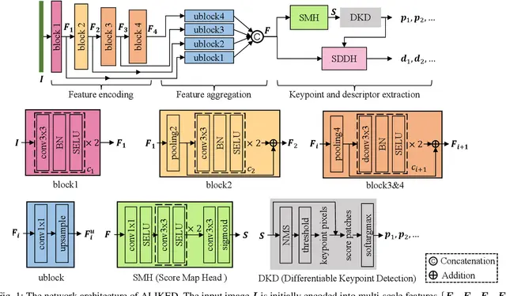
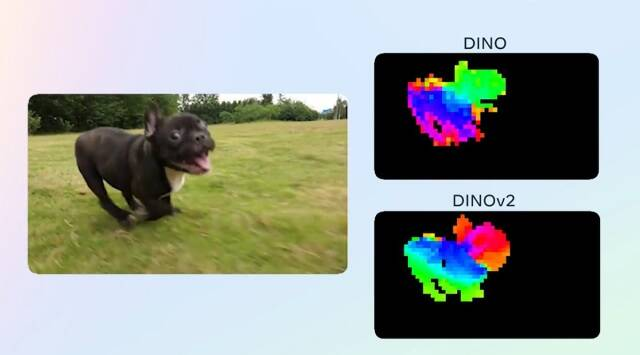
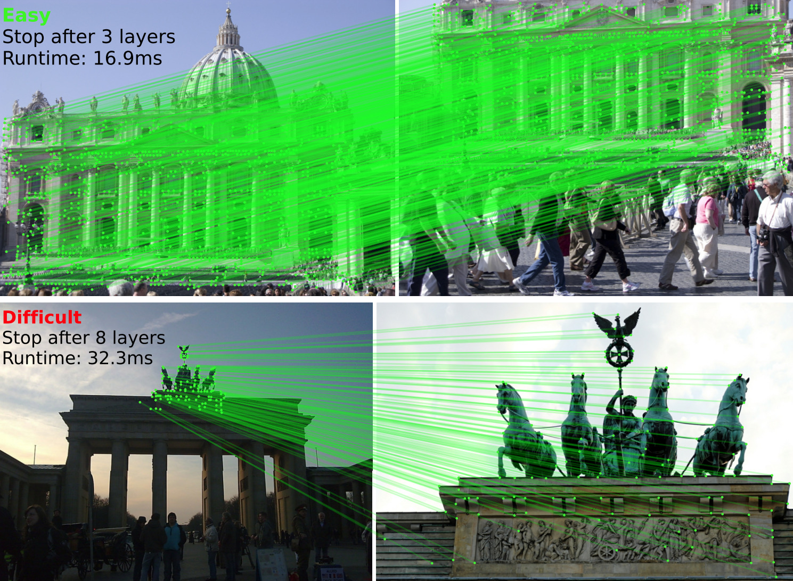

<!DOCTYPE html>
<html lang="en">
<head>
    <meta charset="UTF-8">
    <meta name="viewport" content="width=device-width, initial-scale=1.0">
</head>
<body>
    <h1>3D Image Reconstruction with RANSAC and DINOv2</h1>
    <h2>Overview</h2>
   
    
This project implements a 3D image reconstruction pipeline using Random Sample Consensus (RANSAC) algorithm and DINOv2 for image representations. By combining the robustness of RANSAC with the powerful image representations learned by DINOv2, we aim to reconstruct accurate and detailed 3D models from 2D images.

    <h2>DINOv2</h2>
     
    
DINOv2, short for "DINO: Distributed Neural Networks for Image Representations," is a state-of-the-art self-supervised learning method developed by researchers at Google AI. It learns powerful image representations without requiring manual annotations or labels by leveraging contrastive learning. DINOv2 is known for its scalability, efficiency, and ability to generalize well to unseen data and domains.

    <h2>RANSAC (Random Sample Consensus)</h2>
    
RANSAC is a robust iterative method for estimating parameters of a mathematical model from a set of observed data that may contain outliers. It is widely used in computer vision and image processing for tasks such as image stitching, feature matching, and 3D reconstruction. RANSAC iteratively selects random subsets of data points, fits models to these subsets, and evaluates the models on the entire dataset. It is particularly effective in scenarios where the input data may be noisy or contain outliers.

  
    <h2>Features</h2>
    <ul>
        <li>3D image reconstruction from 2D images</li>
        <li>Robust estimation of geometric transformations using RANSAC</li>
        <li>Utilization of powerful image representations learned by DINOv2</li>
        <li>Support for various image formats and 3D model outputs</li>
        <li>Easy-to-use command-line interface for seamless integration into existing workflows</li>
    </ul>
    <h2>Installation</h2>
    <ol>
        <li>Clone the repository:
            <pre>git clone https://github.com/your_username/3d-reconstruction.git</pre>
        </li>
    </ol>  
    <h2>Contributing</h2>
    
Contributions are welcome! If you have any ideas, bug fixes, or enhancements, feel free to open an issue or submit a pull request.

    <h2>License</h2>
    
This project is licensed under the MIT License - see the <a href="LICENSE">LICENSE</a> file for details.

    <h2>Acknowledgments</h2>
    <ul>
        <li>DINOv2: <a href="https://arxiv.org/abs/2111.00803">Paper</a></li>
        <li>RANSAC: <a href="https://en.wikipedia.org/wiki/Random_sample_consensus">Wikipedia</a></li>
    </ul>
</body>
</html>
